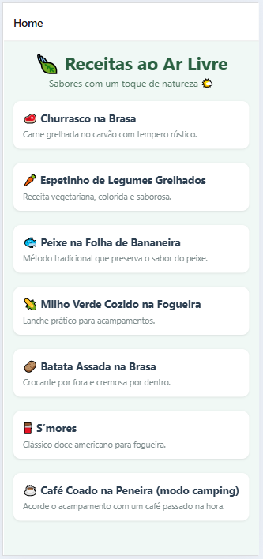
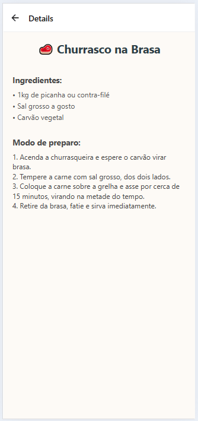

# 📱 App de Receitas ao Ar Livre

Aplicativo criado em **React Native com Expo CLI**, com navegação entre telas, componentes reutilizáveis e dados separados em arquivos. O app exibe uma lista de receitas preparadas ao ar livre. Ao clicar em uma receita, o usuário é levado à tela de detalhes com informações completas.

---

## 🚀 Funcionalidades

- ✅ Lista com 7 receitas ao ar livre
- ✅ Navegação entre telas com React Navigation (Stack)
- ✅ Componentes reutilizáveis (`RecipeCard`)
- ✅ Dados centralizados em `recipes.js`
- ✅ Estilização visual com emojis, cores e layout responsivo

---

## 🧱 Estrutura de Pastas

```
📁 projeto
├── App.js
├── /components
│   └── RecipeCard.js
├── /screens
│   ├── HomeScreen.js
│   └── DetailScreen.js
├── /data
│   └── recipes.js
```

---

## 📦 Dependências

Instale as dependências do projeto com:

```bash
npx expo install react-native-screens react-native-safe-area-context react-native-gesture-handler react-native-reanimated
npx expo install @react-navigation/native @react-navigation/native-stack
```

---

## 🧪 Teste local

Execute o projeto com:

```bash
npx expo start
```

---

## 📱 Capturas de Tela





---

## ✨ Créditos

Criado para prática de:

- Componentização
- Organização em pastas
- Navegação com parâmetros
- UI customizada em React Native
